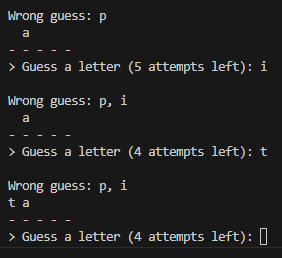

# Игра "Виселица"

## Функция get_rand_word(filename)

Функция открывает файл с именем `filename`, извлекает строки, убирает лишние пробелы в начале и конце каждой строки, затем выбирает случайное слово из этих строк в нижнем регистре.

## Функция print_game(wrong, word, letters)

Функция выводит текущее состояние игры на экран, отображая угаданные и неверные буквы, а также скрытые буквы слова.

## Функция get_letter(attempt, guess)

Функция получает ввод от пользователя для угадывания буквы. Проверяет достоверность ввода и возвращает угаданную букву или ничего (`None`), если ввод неверен.

## Функция play(word)

Главная функция игры. Запускает переменные для отслеживания попыток и угаданных букв, затем постоянно игроку предлагаем угадать букву до тех пор, пока игрок не выиграет или не исчерпает все попытки.
